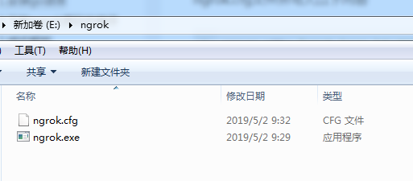
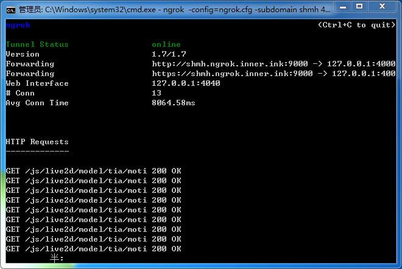
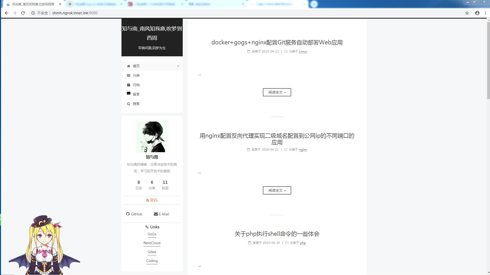

# 一、前言
> **ngrok** 是一个反向代理,通过在公共的端点和本地运行的 Web 服务器之间建立一个安全的通道。
> 简单理解就是可以实现内网穿透到公网。

# 二、准备
> 1台云服务器或者vps+一个域名

# 三、开搞
## 1.安装go语言

```shell
//请下载合适自己的go语言包  我是centos 7 64位 所以选择以下包
wget https://storage.googleapis.com/golang/go1.8.3.linux-amd64.tar.gz
tar -C /usr/local -xzf go1.8.3.linux-amd64.tar.gz
vim /etc/profile
//添加以下内容：
export PATH=$PATH:/usr/local/go/bin
source /etc/profile
//检测是否安装成功go
go version
```
## 2.下载ngrok源码并编译

```shell
mkdir /ngrok
cd /ngrok
git clone https://github.com/inconshreveable/ngrok.git
```
## 3.域名解析

>解析一个二级域名作为你的ngrok客户端访问的域名，记录类型为A记录，记录值ngrok，ip为你的服务器ip。


## 4.给你的域名生成证书
在ngrok根目录下执行以下命令生成证书

```shell
cd /ngrok
openssl genrsa -out rootCA.key 2048
openssl req -x509 -new -nodes -key rootCA.key -subj "/CN=myngork.com" -days 5000 -out rootCA.pem
openssl genrsa -out device.key 2048
openssl req -new -key device.key -subj "/CN=myngork.com" -out device.csr
openssl x509 -req -in device.csr -CA rootCA.pem -CAkey rootCA.key -CAcreateserial -out device.crt -days 5000
```

然后执行覆盖命令

```shell
yes|cp rootCA.pem assets/client/tls/ngrokroot.crt
yes|cp device.crt assets/server/tls/snakeoil.crt
yes|cp device.key assets/server/tls/snakeoil.key
```

## 5.编译服务端ngrokd

> #编译ngrokd（服务器端）
> `make release-server`
编译结束后会在ngrok/bin目录下生成一个ngrokd文件，这个文件就是服务器端启动的程序。

## 6.编译客户端ngrok

当服务器端ngrok启动后，在客户端，也就是window下的需要内网穿透场景的地方也需要一个启动程序来启动。
我客户端电脑是window64位的，所以命令就是`GOOS=windows GOARCH=amd64 make release-client`
编译成功后会在ngrok/bin/windows_amd64/目录下面有ngrok.exe,把这个exe文件下载到你的客户端电脑中。

> #Linux 平台 32 位系统：`GOOS=linux GOARCH=386 make release-client`
> #Linux 平台 64 位系统：`GOOS=linux GOARCH=amd64 make release-client`
> #Windows 平台 32 位系统：`GOOS=windows GOARCH=386 make release-client`
> #Windows 平台 64 位系统：`GOOS=windows GOARCH=amd64 make release-client`
> #MAC 平台 32 位系统：`GOOS=darwin GOARCH=386 make release-client`
> #MAC 平台 64 位系统：`GOOS=darwin GOARCH=amd64 make release-client`
> #ARM 平台：`GOOS=linux GOARCH=arm make release-client`

## 7.启动服务端ngrokd

`/bin/ngrokd -tlsKey="assets/server/tls/snakeoil.key" -tlsCrt="assets/server/tls/snakeoil.crt" -domain="myngrok.com" -httpAddr=":9000" -httpsAddr=":9001" -tunnelAddr=":4443"`

> #参数说明：
> #-domain 访问ngrok是所设置的服务地址生成证书时那个
> #-httpAddr http协议端口 默认为80
> #-httpsAddr https协议端口 默认为443 （可配置https证书）
> #-tunnelAddr 通道端口 默认4443

## 8.内网穿透实例

### 1.在window里启动一个localhost:4000的hexo博客应用程序。
### 2.从服务器上下载ngrok.exe客户端程序，然后创建一个ngrok文件夹，在里面新建一个ngrok.cfg文件并写入以下内容

```yml
server_addr: "ngrok.inner.ink:4443"
trust_host_root_certs: false
```



### 3.启动内网穿透ngrok.exe

打开cmd，然后在ngrok这个目录下输入`ngrok -config=ngrok.cfg -subdomain=shmh 4000`按回车运行



### 4.在浏览器中访问shmh.ngrok.inner.ink:9000

可以看到我的博客已经被访问了，而且ngrok客服端中也会有GET报文出现。



### 5.配置deploy.bat文件方便启动

```bat
@echo OFF
color 0a
Title ngrok启动
Mode con cols=109 lines=30
:START
ECHO.
Echo                  ==========================================================================
ECHO.
Echo                                         ngrok启动
ECHO.
Echo                                         作者: 知与南
ECHO.
Echo                  ==========================================================================
Echo.
echo.
echo.
:NGROKD
Echo           1.请输入自定义域名前缀，如“test”，即分配给你的穿透域名为：“test.ngrok.inner.ink”
ECHO.
set /p clientid=   请输入：
echo.
Echo           2.输入需要本地应用端口号，如“4000“
ECHO.
set /p port=   请输入：
echo.
ngrok -config=ngrok.cfg -subdomain=%clientid% %port%
PAUSE
goto NGROKD
```

### 6.这样每次启动程序，只需要双击deploy.bat文件，根据提示输入自定义域名和本地端口按回车运行就可以了。

